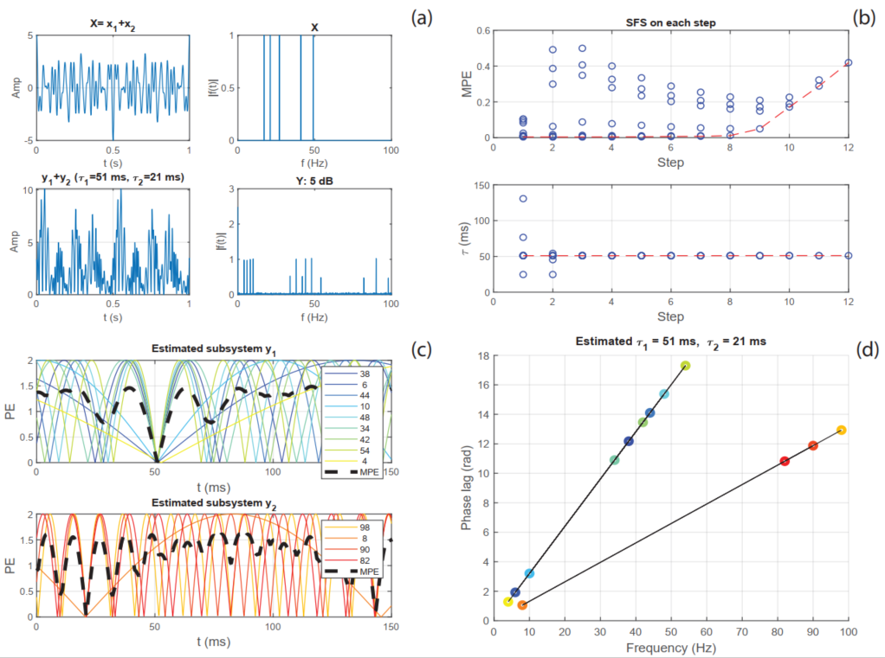

# ALPC-SFS-method-Matlab-scripts
the Matlab scripts for the ALPC-SFS method


The three example simulations were generated by using the following scripts respectively.
```
ALPC_simulation_Example1.m 
ALPC_simulation_Example2.m
ALPC_simulation_Example3.m
```

A demo of results of ALPC_simulation_Example1.m:

<p align="center">
    </a>
</p>

The paper (to be published) can be found [here](https://doi.org/10.1101/2020.09.27.315614).
